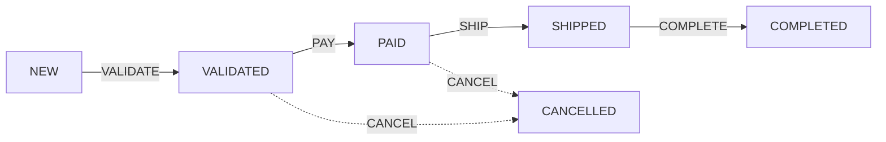

#  Order Management System (Spring State Machine)

> [!NOTE]
> Desenvolvido para fins de estudo sobre Arquitetura de Software e Spring Ecosystem.

Este projeto é uma implementação de referência para gerenciamento de estados de pedidos (Order Management) utilizando **Java**, **Spring Boot** e **Spring State Machine**.

O objetivo é demonstrar como controlar o ciclo de vida de um pedido de forma robusta, utilizando **Guards** (validações) e **Actions** (ações laterais) separadas da configuração principal.

##  Tecnologias Utilizadas

* **Java 17+**
* **Spring Boot 3**
* **Spring State Machine**
* **Lombok**
* **Maven**

##  Fluxo de Estados (State Flow)

A máquina de estados foi configurada para seguir o seguinte fluxo de negócio:

`NEW` ➝ `VALIDATED` ➝ `PAID` ➝ `SHIPPED` ➝ `COMPLETED`

Além disso, existem fluxos de cancelamento e validações de segurança (Guards).

### Diagrama Simplificado



### Funcionalidades Implementadas
* State Machine Config: Configuração centralizada das transições.
* Actions Separadas: Lógica de negócio (Logs, envio de e-mail, etc) desacoplada em classes específicas (OrderActions).
* Guards (Proteção): Implementação de "porteiros" que impedem transições inválidas.
* Exemplo: O pedido só muda para PAID se um payment_id válido for fornecido.
* API REST: Endpoints para interagir e testar a máquina de estados.

### Estrutura do Projeto
O projeto segue boas práticas de organização:
```
src/main/java/com/practice/order_management_ssm
├── actions       # Ações executadas durante as transições
├── config        # Configuração da State Machine
├── controllers   # Endpoints REST
├── enums         # Definição de Estados e Eventos
├── guards        # Regras condicionais (Validações)
└── services      # Lógica de negócio e persistência
```

